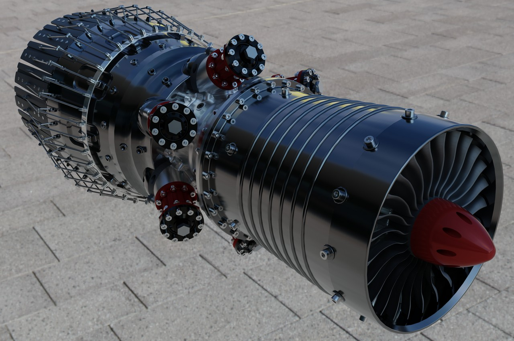

# Aurora
**Aurora** is a real-time path tracing renderer that leverage GPU hardware ray tracing. As a real-time renderer, it is intended to support rapid design iteration in a real-time viewport, which differs from "final frame" production rendering from a render like Autodesk Arnold. Aurora has a USD Hydra render delegate called HdAurora, which allows it to be used from a USD Hydra scene delegate. It can also be used directly through its own API.

Aurora is developed and maintained by Autodesk. It is fully open source under the Apache license, with feature requests and contributions welcome!

<i>A screenshot of a sample model rendered in Autodesk Inventor 2023, using the HdAurora render delegate.</i>

